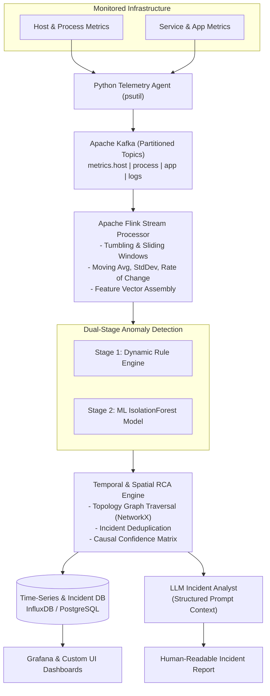

# Nexus: Distributed Observability & Intelligent System Monitoring Platform

A production-grade, distributed observability, real-time stream processing, anomaly detection, and automated root-cause analysis (RCA) platform.



---

## Key Features

1. **Lightweight Distributed Telemetry Agent**: Collects Host CPU/RAM/Disk/Net (`psutil`), Process stats, Docker container stats (`docker-py`), and HTTP/TCP dependency latency.
2. **Key-Partitioned Kafka Ingestion**: Topic architecture partitioned by `host_id` to maintain strict temporal ordering across distributed nodes.
3. **Stateful Stream Processing Engine**: Apache Flink / PyFlink sliding windows computing 5-minute moving averages ($\mu$), standard deviations ($\sigma$), linear slopes ($\Delta y / \Delta t$), and feature vectors.
4. **Dual-Stage Anomaly Detection**:
   - **Stage 1 (Rule Engine)**: Evaluates dynamic operational boundaries and temporal persistence filters.
   - **Stage 2 (Machine Learning)**: Scikit-learn `IsolationForest` computing continuous anomaly scores $S \in [0, 1]$.
5. **Graph Causal Root Cause Analysis (RCA)**: Models microservice topology in `NetworkX` and performs topological causal path search combined with alert timestamps to identify root cause components.
6. **LLM Post-Mortem Analyst**: OpenAI / Ollama integration generating executive incident post-mortems and recommended remediation actions.
7. **Synthetic Chaos Injection**: Controlled failure generator (`stress-ng`, memory allocators) to reproduce incidents and benchmark detection accuracy.

---

## Quickstart Guide

### 1. Environment Setup
Create and activate the virtual environment:
```bash
python3 -m venv venv
source venv/bin/activate
pip install -r backend/requirements.txt -r agent/requirements.txt -r streaming/requirements.txt
```

### 2. Start Infrastructure Services
Spin up Kafka, InfluxDB, PostgreSQL, and Grafana via Docker Compose:
```bash
make infra-up
```
* **Grafana**: `http://localhost:3000` (User: `admin`, Pass: `admin`)
* **InfluxDB**: `http://localhost:8086` (Token: `nexus-secret-token-super-secure`)
* **FastAPI Backend**: `http://localhost:8000/docs`

### 3. Run Telemetry Agent
```bash
./venv/bin/python agent/main.py
```

### 4. Run Stream Processor
```bash
./venv/bin/python streaming/flink_job.py
```

### 5. Start Backend Intelligence Service
```bash
./venv/bin/uvicorn backend.app.main:app --reload --port 8000
```

### 6. Execute Chaos Experiment
Run CPU and Memory chaos injection scenarios:
```bash
./venv/bin/python chaos/chaos_runner.py --scenario cpu --duration 15
```

---

## Component Architecture

* `agent/`: Telemetry agent collectors and Kafka publisher.
* `streaming/`: Stateful sliding window stream processing and feature vector transformations.
* `backend/`: FastAPI application, database schemas, Rule Engine, ML Anomaly Detector, NetworkX RCA Engine, and LLM Analyst.
* `chaos/`: Failure injection scenarios and experiment runner.
* `config/`: Docker configurations and auto-provisioned Grafana datasources/dashboards.
* `docs/`: Technical specifications for streaming math and RCA causal algorithms.

---

## API Documentation

FastAPI provides an interactive OpenAPI UI at `http://localhost:8000/docs`:
* `POST /api/v1/metrics/ingest`: Ingest telemetry features, trigger Rule/ML anomaly detection, write to time-series DB.
* `GET /api/v1/incidents/`: List active and resolved system incidents.
* `POST /api/v1/incidents/`: Create a new incident and trigger automated RCA.
* `POST /api/v1/rca/analyze`: Execute dependency graph traversal to analyze root cause for a given symptom.
* `GET /api/v1/topology/`: Retrieve full infrastructure dependency graph.

---

## License
MIT License
